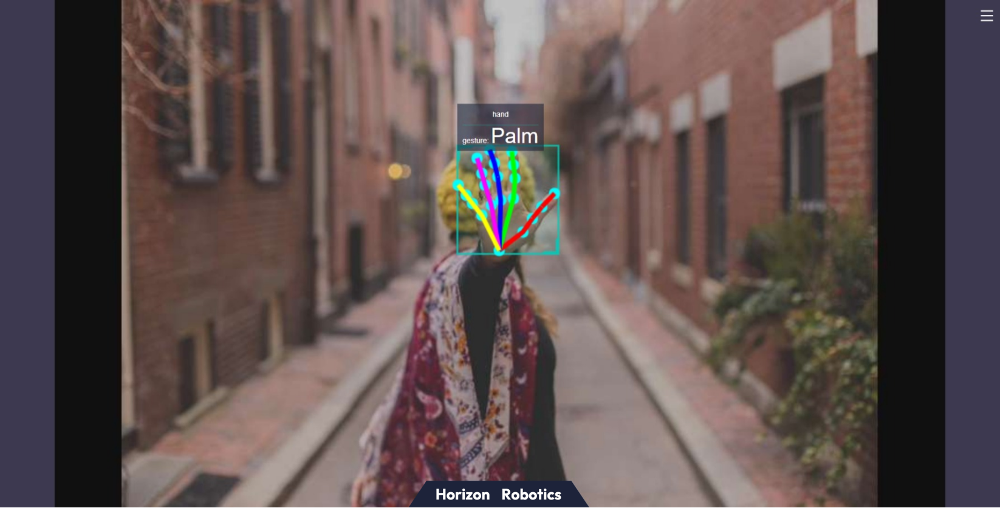

English| [简体中文](./README_cn.md)

# Function Introduction

The gesture recognition algorithm example subscription includes the algorithm msg containing information about hand bounding boxes and hand keypoints, utilizes BPU for inference, and publishes intelligent results msg containing gesture information.

The supported gesture recognition categories of the algorithm, as well as the corresponding numerical values in the algorithm msg (Attribute member with type "gesture"), are as follows:

| Gesture     | Description     | Value     |
| ---------- | ---------- | ---------- |
| ThumbUp    | Thumb up gesture     | 2 |
| Victory    | "V" gesture    | 3 |
| Mute       | "Shh" gesture    | 4 |
| Palm       | Palm gesture    | 5 |
| Okay       | OK gesture    | 11 |
| ThumbLeft  | Thumb pointing left    | 12 |
| ThumbRight | Thumb pointing right    | 13 |
| Awesome    | 666 gesture    | 14 |

Application Scenarios: The gesture recognition algorithm integrates technologies such as hand keypoint detection and gesture analysis, enabling the computer to interpret human gestures into corresponding commands. It can realize functions like gesture control and sign language translation, mainly applied in smart homes, smart cockpits, smart wearable devices, and other fields.

# Bill of Materials

| Item Name            | Manufacturer | Reference Link                                                    |
| :------------------ | -------- | ------------------------------------------------------------ |
| RDK X3 / RDK Ultra  | Multiple manufacturers | [RDK X3](https://developer.horizon.cc/rdkx3)<br>[RDK Ultra](https://developer.horizon.cc/rdkultra) |
| camera              | Multiple manufacturers | [MIPI Camera](https://developer.horizon.cc/nodehubdetail/168958376283445781)<br>[USB Camera](https://developer.horizon.cc/nodehubdetail/168958376283445777)|

# Preparation

- The Horizon RDK has been imaged with the Ubuntu 20.04 system provided by the Horizon.
- The camera is correctly connected to RDK X3.

# Instructions

**1. Install the Function Package**

After the robot is started, connect to the robot via SSH terminal or VNC. Click the "One-Click Deployment" button on this page's top right corner, copy and run the following command on the RDK system to complete the installation of the related Nodes.

tros foxy:
```bash
sudo apt update
sudo apt install -y tros-hand-gesture-detection
```

tros humble:
```bash
sudo apt update
sudo apt install -y tros-humble-hand-gesture-detection
```

**2. Run the Hand Recognition Detection Feature**

**Publish Images Using MIPI Camera**

tros foxy:
```shell
# Configure the tros.b environment
source /opt/tros/setup.bash

# Copy the configuration files required for running examples from the installation path of tros.b.
cp -r /opt/tros/${TROS_DISTRO}/lib/mono2d_body_detection/config/ .
cp -r /opt/tros/${TROS_DISTRO}/lib/hand_lmk_detection/config/ .
cp -r /opt/tros/${TROS_DISTRO}/lib/hand_gesture_detection/config/ .

# Configure MIPI camera
export CAM_TYPE=mipi

# Launch the launch file
ros2 launch hand_gesture_detection hand_gesture_detection.launch.py
```

tros humble:
```shell
# Configure the tros.b humble environment
source /opt/tros/humble/setup.bash

# Copy the configuration files required for running examples from the installation path of tros.b.
cp -r /opt/tros/${TROS_DISTRO}/lib/mono2d_body_detection/config/ .
cp -r /opt/tros/${TROS_DISTRO}/lib/hand_lmk_detection/config/ .
cp -r /opt/tros/${TROS_DISTRO}/lib/hand_gesture_detection/config/ .

# Configure MIPI camera
export CAM_TYPE=mipi

# Launch the launch file
ros2 launch hand_gesture_detection hand_gesture_detection.launch.py
```

**Publish Images Using USB Camera**

tros foxy:
```shell
# Configure the tros.b environment
source /opt/tros/setup.bash

# Copy the configuration files required for running examples from the installation path of tros.b.
cp -r /opt/tros/${TROS_DISTRO}/lib/mono2d_body_detection/config/ .
cp -r /opt/tros/${TROS_DISTRO}/lib/hand_lmk_detection/config/ .
cp -r /opt/tros/${TROS_DISTRO}/lib/hand_gesture_detection/config/ .

# Configure USB camera
export CAM_TYPE=usb

# Launch the launch file
ros2 launch hand_gesture_detection hand_gesture_detection.launch.py
```

tros humble:
```shell
# Configure the tros.b humble environment
source /opt/tros/humble/setup.bash

# Copy the configuration files required for running examples from the installation path of tros.b.
cp -r /opt/tros/${TROS_DISTRO}/lib/mono2d_body_detection/config/ .
cp -r /opt/tros/${TROS_DISTRO}/lib/hand_lmk_detection/config/ .
cp -r /opt/tros/${TROS_DISTRO}/lib/hand_gesture_detection/config/ .

# Configure USB camera
export CAM_TYPE=usb

# Launch the launch file
ros2 launch hand_gesture_detection hand_gesture_detection.launch.py
```

**3. Check the Effect**

Open a browser on the same network computer and visit [http://IP:8000](http://IP:8000) to see the real-time effect of visual recognition, where IP is the IP address of RDK:


# Interface Specification

## Topics

The results of human body recognition and gesture awakening are published through the [hobot_msgs/ai_msgs/msg/PerceptionTargets](https://github.com/HorizonRDK/hobot_msgs/blob/develop/ai_msgs/msg/PerceptionTargets.msg) topic. The detailed definition of this topic is as follows:

```shell
# Perception Result

# Message header
std_msgs/Header header

# Frame rate of perception results
# fps val is invalid if fps is less than 0

int16 fps

# Performance statistics, such as recording the time consumption of each model inference
Perf[] perfs

# Perception target collection
Target[] targets

# Disappeared target collection
Target[] disappeared_targets
```

| Name                 | Message Type        | Description|
| ---------------------- | ----------- |---------------------------- |
| /hobot_hand_gesture_detection     | [hobot_msgs/ai_msgs/msg/PerceptionTargets](https://github.com/HorizonRDK/hobot_msgs/blob/develop/ai_msgs/msg/PerceptionTargets.msg)     | Publish detected gesture target information (only appears when gesture wake-up is enabled) |
| /hobot_mono2d_body_detection          | [hobot_msgs/ai_msgs/msg/PerceptionTargets](https://github.com/HorizonRDK/hobot_msgs/blob/develop/ai_msgs/msg/PerceptionTargets.msg)   | Subscribe to the human body target information recognized by the previous node, including human body bounding box, hand bounding box, and human body keypoints |
| /hobot_hand_lmk_detection | [hobot_msgs/ai_msgs/msg/PerceptionTargets](https://github.com/HorizonRDK/hobot_msgs/blob/develop/ai_msgs/msg/PerceptionTargets.msg)  |  Subscribe to the hand keypoint information recognized by the previous node (only appears when gesture wake-up is enabled) |
| /hbmem_img | [hobot_msgs/hbm_img_msgs/msg/HbmMsg1080P](https://github.com/HorizonRDK/hobot_msgs/blob/develop/hbm_img_msgs/msg/HbmMsg1080P.msg)  | Subscribe to image data published by the previous node using shared memory communication method when is_shared_mem_sub == 1|
| /image_raw | hsensor_msgs/msg/Image  | Subscribe to the relevant image data published by the previous node using the ordinary ROS method when is_shared_mem_sub == 0|

## Parameters

| Parameter Name         | Type          | Explanation                                 | Mandatory | Supported Configuration | Default Value               |
| ---------------------- | ----------- | ------------------------------------------- | -------- | -------------------- | ----------------------------- |
| is_sync_mode           | int         | Synchronous/asynchronous inference mode. 0: asynchronous mode; 1: synchronous mode | No       | 0/1                  | 0                             |
| model_file_name        | std::string | Model file used for inference               | No       | Configure based on actual model path | config/handLMKs.hbm           |
| ai_msg_pub_topic_name   | std::string | Topic name for publishing intelligent messages containing gesture category detection results | No       | Configure based on actual deployment environment | /hobot_hand_gesture_detection |
| ai_msg_sub_topic_name | std::string | Topic name for subscribing to intelligent messages containing hand keypoint results | No       | Configure based on actual deployment environment | /hobot_hand_lmk_detection     |

# Reference

Implementation of game character control based on gesture recognition and human pose analysis: [Playing X3 Pie, a fitness game with two birds](https://developer.horizon.cc/forumDetail/112555512834430487)

