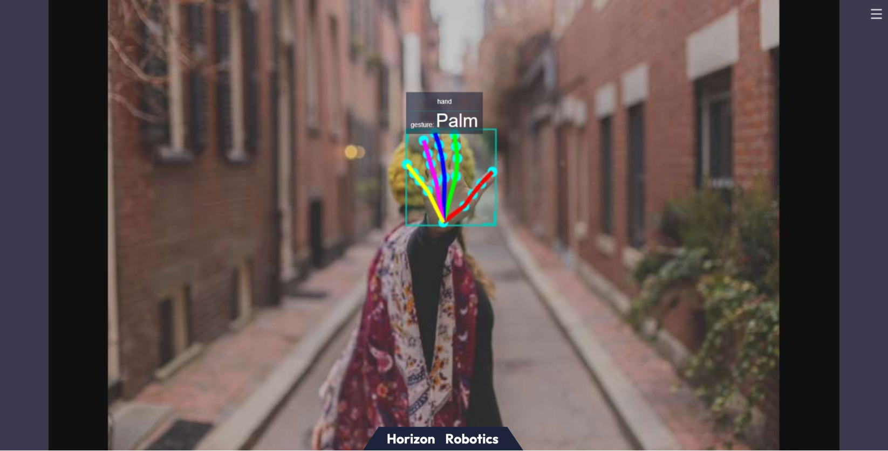

[English](./README.md) | 简体中文

# 功能介绍

手势识别算法示例订阅包含人手框、人手关键点信息的算法msg，利用BPU进行推理，发布包含手势信息的智能结果msg。

算法支持的手势识别类别，以及手势类别在算法msg（Attribute成员，type为"gesture"）中对应的数值如下：

| 手势       | 说明 | 数值 |
| ---------- | ---------- | ---------- |
| ThumbUp    | 竖起大拇指 | 2 |
| Victory    | “V”手势    | 3 |
| Mute       | “嘘”手势   | 4 |
| Palm       | 手掌       | 5 |
| Okay       | OK手势     | 11 |
| ThumbLeft  | 大拇指向左 | 12 |
| ThumbRight | 大拇指向右 | 13 |
| Awesome    | 666手势    | 14 |


应用场景：手势识别算法集成了人手关键点检测，手势分析等技术，使得计算机能够将人的手势解读为对应指令，可实现手势控制以及手语翻译等功能，主要应用于智能家居，智能座舱、智能穿戴设备等领域。

# 物料清单

| 物料名称            | 生产厂家 | 参考链接                                                     |
| :------------------ | -------- | ------------------------------------------------------------ |
| RDK X3 / RDK Ultra  | 多厂家 | [RDK X3](https://developer.horizon.cc/rdkx3)<br>[RDK Ultra](https://developer.horizon.cc/rdkultra) |
| camera              | 多厂家 | [MIPI相机](https://developer.horizon.cc/nodehubdetail/168958376283445781)<br>[USB相机](https://developer.horizon.cc/nodehubdetail/168958376283445777)|


# 准备工作

- 地平线RDK已烧录好地平线提供的Ubuntu 20.04系统镜像
- 摄像头正确连接到RDK X3

# 使用方法

**1.安装功能包**

启动机器人后，通过SSH终端或者VNC连接机器人，点击本页面右上方的“一键部署”按钮，复制如下命令在RDK的系统上运行，完成相关Node的安装。

tros foxy 版本
```bash
sudo apt update
sudo apt install -y tros-hand-gesture-detection
```

tros humble 版本
```bash
sudo apt update
sudo apt install -y tros-hand-gesture-detection
```

**2.运行人手识别检测功能**

**使用MIPI摄像头发布图片**

tros foxy 版本
```shell
# 配置tros.b环境
source /opt/tros/setup.bash

# 从tros.b的安装路径中拷贝出运行示例需要的配置文件。
cp -r /opt/tros/${TROS_DISTRO}/lib/mono2d_body_detection/config/ .
cp -r /opt/tros/${TROS_DISTRO}/lib/hand_lmk_detection/config/ .
cp -r /opt/tros/${TROS_DISTRO}/lib/hand_gesture_detection/config/ .

# 配置MIPI摄像头
export CAM_TYPE=mipi

# 启动launch文件
ros2 launch hand_gesture_detection hand_gesture_detection.launch.py
```

tros humble 版本
```shell
# 配置tros.b humble环境
source /opt/tros/humble/setup.bash

# 从tros.b的安装路径中拷贝出运行示例需要的配置文件。
cp -r /opt/tros/${TROS_DISTRO}/lib/mono2d_body_detection/config/ .
cp -r /opt/tros/${TROS_DISTRO}/lib/hand_lmk_detection/config/ .
cp -r /opt/tros/${TROS_DISTRO}/lib/hand_gesture_detection/config/ .

# 配置MIPI摄像头
export CAM_TYPE=mipi

# 启动launch文件
ros2 launch hand_gesture_detection hand_gesture_detection.launch.py
```

**使用USB摄像头发布图片**

tros foxy 版本
```shell
# 配置tros.b环境
source /opt/tros/setup.bash

# 从tros.b的安装路径中拷贝出运行示例需要的配置文件。
cp -r /opt/tros/${TROS_DISTRO}/lib/mono2d_body_detection/config/ .
cp -r /opt/tros/${TROS_DISTRO}/lib/hand_lmk_detection/config/ .
cp -r /opt/tros/${TROS_DISTRO}/lib/hand_gesture_detection/config/ .

# 配置USB摄像头
export CAM_TYPE=usb

# 启动launch文件
ros2 launch hand_gesture_detection hand_gesture_detection.launch.py
```

tros humble 版本
```shell
# 配置tros.b humble环境
source /opt/tros/humble/setup.bash

# 从tros.b的安装路径中拷贝出运行示例需要的配置文件。
cp -r /opt/tros/${TROS_DISTRO}/lib/mono2d_body_detection/config/ .
cp -r /opt/tros/${TROS_DISTRO}/lib/hand_lmk_detection/config/ .
cp -r /opt/tros/${TROS_DISTRO}/lib/hand_gesture_detection/config/ .

# 配置USB摄像头
export CAM_TYPE=usb

# 启动launch文件
ros2 launch hand_gesture_detection hand_gesture_detection.launch.py
```

**3.查看效果**

打开同一网络电脑的浏览器，访问[http://IP:8000](http://IP:8000)即可看到视觉识别的实时效果，其中IP为RDK的IP地址:


# 接口说明

## 话题

人体识别和手势唤醒的结果都通过[hobot_msgs/ai_msgs/msg/PerceptionTargets](https://github.com/HorizonRDK/hobot_msgs/blob/develop/ai_msgs/msg/PerceptionTargets.msg)话题发布，该话题的详细定义如下：
```shell
# 感知结果

# 消息头
std_msgs/Header header

# 感知结果的处理帧率
# fps val is invalid if fps is less than 0
int16 fps

# 性能统计信息，比如记录每个模型推理的耗时
Perf[] perfs

# 感知目标集合
Target[] targets

# 消失目标集合
Target[] disappeared_targets
```

| 名称                 | 消息类型        | 说明|
| ---------------------- | ----------- |---------------------------- |
| /hobot_hand_gesture_detection     | [hobot_msgs/ai_msgs/msg/PerceptionTargets](https://github.com/HorizonRDK/hobot_msgs/blob/develop/ai_msgs/msg/PerceptionTargets.msg)     | 发布识别到的手势目标信息（开启手势唤醒之后才会出现） |
| /hobot_mono2d_body_detection          | [hobot_msgs/ai_msgs/msg/PerceptionTargets](https://github.com/HorizonRDK/hobot_msgs/blob/develop/ai_msgs/msg/PerceptionTargets.msg)   | 订阅前一个node识别到的人体目标信息，包括人体框、人手框、人体关键点 |
| /hobot_hand_lmk_detection | [hobot_msgs/ai_msgs/msg/PerceptionTargets](https://github.com/HorizonRDK/hobot_msgs/blob/develop/ai_msgs/msg/PerceptionTargets.msg)  |  订阅前一个node识别到的手关键点信息（开启手势唤醒之后才会出现） |
| /hbmem_img | [hobot_msgs/hbm_img_msgs/msg/HbmMsg1080P](https://github.com/HorizonRDK/hobot_msgs/blob/develop/hbm_img_msgs/msg/HbmMsg1080P.msg)  | 当is_shared_mem_sub == 1时，用shared mem通信方式订阅上一个node发布图像数据|
| /image_raw | hsensor_msgs/msg/Image  |  当is_shared_mem_sub == 0时，订阅用ros的普通方式订阅上一个node发布相关的图像数据|

## 参数

| 参数名                 | 类型        | 解释                                        | 是否必须 | 支持的配置           | 默认值                        |
| ---------------------- | ----------- | ------------------------------------------- | -------- | -------------------- | ----------------------------- |
| is_sync_mode           | int         | 同步/异步推理模式。0：异步模式；1：同步模式 | 否       | 0/1                  | 0                             |
| model_file_name        | std::string | 推理使用的模型文件                          | 否       | 根据实际模型路径配置 | config/handLMKs.hbm           |
| ai_msg_pub_topic_name   | std::string | 发布包含手势类别检测结果的智能消息的topic名 | 否       | 根据实际部署环境配置 | /hobot_hand_gesture_detection |
| ai_msg_sub_topic_name | std::string | 订阅包含人手关键点结果的智能消息的topic名     | 否       | 根据实际部署环境配置 | /hobot_hand_lmk_detection     |


# 参考资料

基于手势识别以及人体姿态分析实现游戏人物控制案例：[玩转X3派，健身游戏两不误](https://developer.horizon.cc/forumDetail/112555512834430487)


